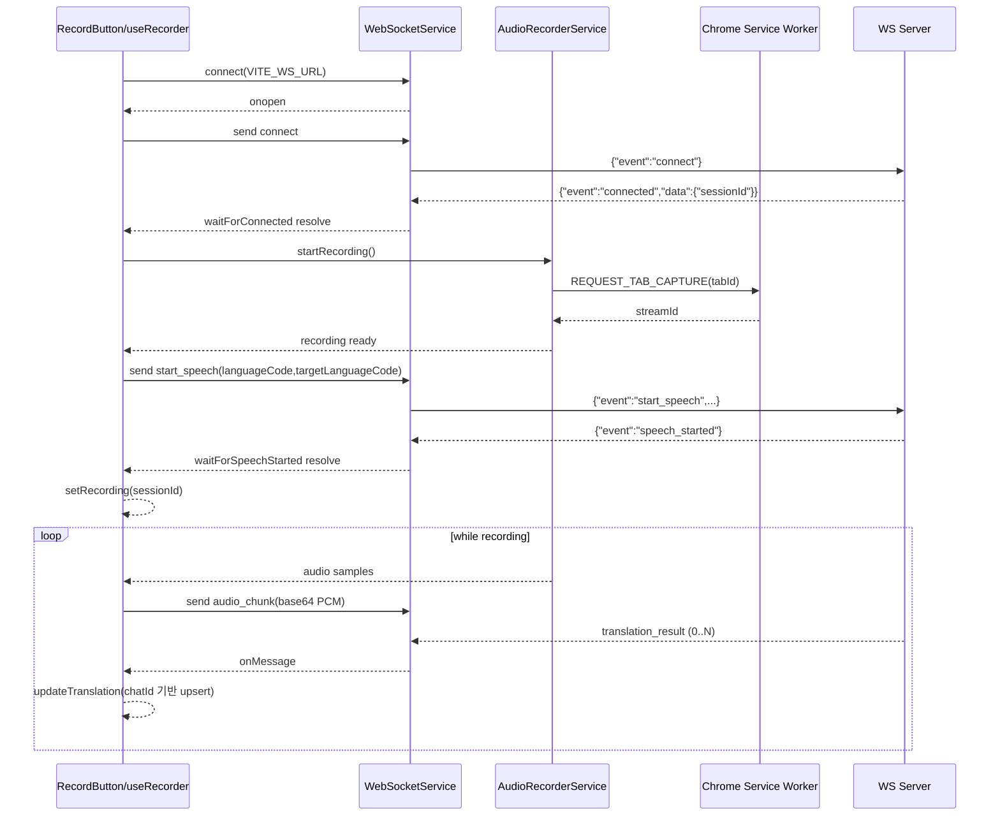
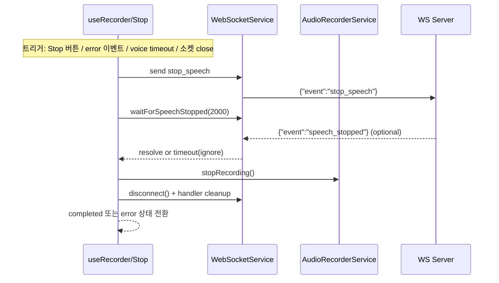

# Tab Translator (Chrome Extension)

Chrome Side Panel에서 현재 탭 오디오를 캡처하고, WebSocket 기반으로 실시간 번역 결과를 표시하는 확장 프로그램입니다.

## 주요 기능

- Side Panel UI에서 녹음 시작/중지
- `chrome.tabCapture` 기반 탭 오디오 캡처
- 16kHz PCM(Int16, Base64) 오디오 chunk WebSocket 전송
- 실시간 번역 결과 누적/갱신 표시
- 소스/타겟 언어 선택

## 사전 요구사항

- Node.js 18+
- pnpm (권장, `packageManager: pnpm@10.10.0`)
- Chrome (확장 프로그램 개발자 모드 사용)

## 설치 및 환경 변수

```bash
pnpm install
```

프로젝트 루트에 `.env` 파일을 만들고 아래 값을 설정하세요.

```env
VITE_API_URL=https://your-api-server
VITE_WS_URL=wss://your-ws-server
```

- `VITE_API_URL`: 언어 목록 API 호출 베이스 URL (`/api/languages` 사용)
- `VITE_WS_URL`: 실시간 번역 WebSocket 서버 URL

## 개발/빌드/로컬 로드

```bash
pnpm run dev
```

```bash
pnpm run build
```

Chrome에서 확장 프로그램 로드:

1. `chrome://extensions` 접속
2. 우측 상단 `개발자 모드` 활성화
3. `압축해제된 확장 프로그램을 로드합니다` 클릭
4. 프로젝트의 `dist` 폴더 선택

## 스크립트

```bash
pnpm run dev              # Vite 개발 서버
pnpm run build            # TypeScript 빌드 + Vite 빌드
pnpm run preview          # Vite preview
pnpm run test             # Vitest
pnpm run test:ui          # Vitest UI
pnpm run test:coverage    # 커버리지 리포트
pnpm run lint             # ESLint
pnpm run typecheck        # 타입 체크
pnpm run generate:icons   # 아이콘 생성 스크립트
```

## 프로젝트 구조

```text
src/
├── app/                              # App 엔트리
├── chrome/
│   ├── background/service-worker.ts  # 액션 클릭/탭 캡처 메시지 처리
│   ├── messaging/                    # runtime message 유틸/타입
│   └── sidepanel/                    # Side Panel HTML/React 엔트리
├── features/
│   └── recorder/
│       ├── components/               # Recorder UI 컴포넌트
│       ├── hooks/                    # useRecorder, useLanguages
│       ├── services/                 # AudioRecorderService, WebSocketService
│       ├── stores/                   # Zustand 스토어
│       └── types/                    # 도메인/소켓 타입
└── shared/utils/                     # Result/함수형 유틸
```

## 기술 스택

- React 19 + TypeScript
- Zustand (상태 관리)
- Vite 6 + `@crxjs/vite-plugin` (Chrome Extension 번들)
- Tailwind CSS
- Vitest + Testing Library

## WebSocket 이벤트 처리 상세

### 1) 이벤트 타입

클라이언트 -> 서버:

- `connect`
- `start_speech`
- `audio_chunk`
- `stop_speech`

서버 -> 클라이언트:

- `connected`
- `speech_started`
- `speech_stopped`
- `translation_result`
- `error`
- `voice_activity`
- `speech_result` (타입 정의만 있고 현재 UI 처리 미사용)

### 2) 이벤트별 처리 테이블

| event | 방향 | payload 핵심 | 처리 위치 | 상태/UI 영향 | 타임아웃/예외 |
|---|---|---|---|---|---|
| `connect` | C -> S | 없음 | `useRecorder.startRecording` -> `wsService.sendConnect()` | 연결 핸드셰이크 시작 | 소켓 미연결 시 전송 실패 |
| `connected` | S -> C | `sessionId` | `waitForConnected()` | `setRecording(sessionId)`에 사용 | 기본 5초 대기 타임아웃 |
| `start_speech` | C -> S | `languageCode`, `targetLanguageCode`(선택) | `wsService.sendStartSpeech(...)` | STT 시작 요청 | 전송 실패 시 녹음 시작 실패 처리 |
| `speech_started` | S -> C | 없음 | `waitForSpeechStarted()` | 녹음 상태 전환 직전 동기화 포인트 | 기본 5초 대기 타임아웃 |
| `audio_chunk` | C -> S | `audio`(Base64 Int16 PCM) | `AudioRecorderService.onAudioChunk` -> `encodeAudioChunk` -> `sendAudioChunk` | 실시간 오디오 스트리밍 | chunk 전송 실패 시 경고 로그만 남기고 지속 |
| `translation_result` | S -> C | `chatId`, `translatedText`, `isFinal` 등 | `wsService.onMessage` in `useRecorder` | `useTranslationStore.updateTranslation`로 UI 갱신 | 동일 `chatId` 항목 업데이트 |
| `error` | S -> C | `error` 문자열 | `wsService.onMessage` in `useRecorder` | `stopRecordingFlow(error)` 실행 후 `error` 상태 | 종료 플로우에서 정리 수행 |
| `voice_activity` | S -> C | `type`, `message`, `timestamp` | `wsService.onMessage` in `useRecorder` | `type === 'timeout'`이면 자동 종료 | 사용자 stop 없이 종료될 수 있음 |
| `stop_speech` | C -> S | 없음 | `stopRecordingFlow` -> `sendStopSpeech()` | 종료 핸드셰이크 시작 | 전송 실패여도 이후 정리 시도 |
| `speech_stopped` | S -> C | 없음 | `waitForSpeechStopped(2000)` | 서버 종료 확인 | 2초 타임아웃 시 무시하고 로컬 정리 진행 |
| `speech_result` | S -> C | `transcript`, `isFinal` | (현재 미사용) | 현재 store/UI 반영 없음 | 타입만 존재 |

### 3) 녹음 시작 시퀀스



### 4) 녹음 종료 시퀀스



### 5) 예외 처리 규칙

- 소켓 연결 실패/타임아웃 시 시작 플로우 중단 후 `error` 상태 전환
- 서버 `error` 이벤트 수신 시 `stopRecordingFlow(errorMessage)` 실행
- `voice_activity.type === "timeout"` 수신 시 자동 stop 플로우 실행
- 소켓 `onclose` 발생 시 현재 상태가 `recording/requesting`이면 stop 플로우 실행
- stop 과정의 `speech_stopped` 대기는 최대 2초, 타임아웃은 무시하고 로컬 정리 진행

## 라이선스

MIT
